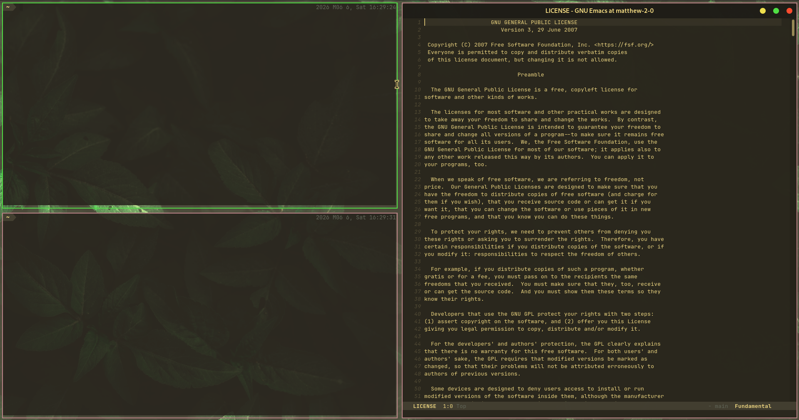

# night-light-plugin



A [miracle-wm](https://github.com/mattkae/miracle-wm) plugin that gradually shades the screen toward warm orange overnight to reduce blue light. The tint ramps up between 6pm and 9pm, is strongest from 9pm to 6am, and fades out between 6am and 8am.

## Installation

Download and install the latest nightly build:

```sh
curl -fsSL https://raw.githubusercontent.com/miracle-wm-org/night-light-plugin/main/install.sh | bash
```

Alternatively, manually add the plugin to your miracle-wm configuration file (`~/.config/miracle-wm/config.yaml`):

```yaml
plugins:
  - /path/to/night-light-plugin/target/wasm32-wasip1/release/night_light_plugin.wasm
```

## Building

### Prerequisites
```sh
sudo apt-get install -y libmircore-dev clang libclang-dev
rustup target add wasm32-wasip1
```

### Compilation
```sh
cargo build --target wasm32-wasip1 --release
```
The compiled WASM file can be found at `target/wasm32-wasip1/release/night_light_plugin.wasm`.
